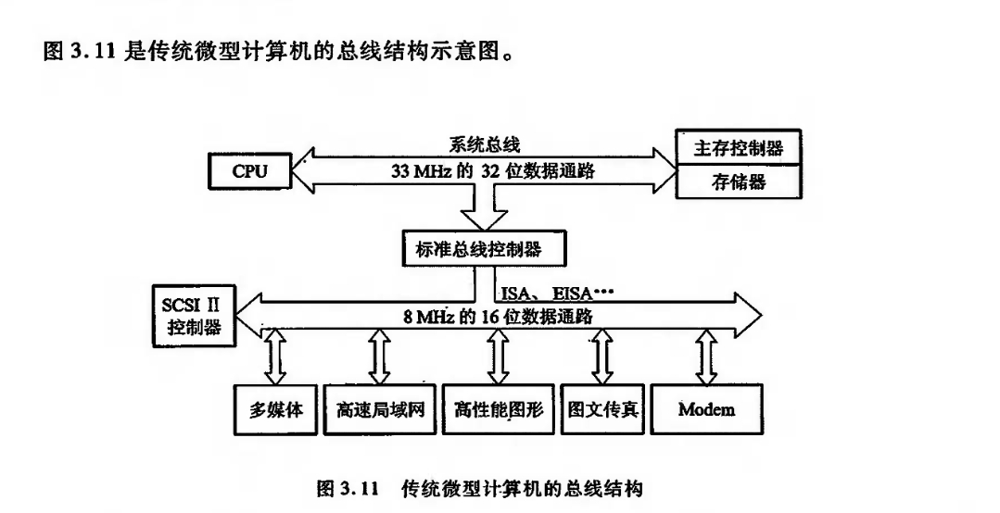
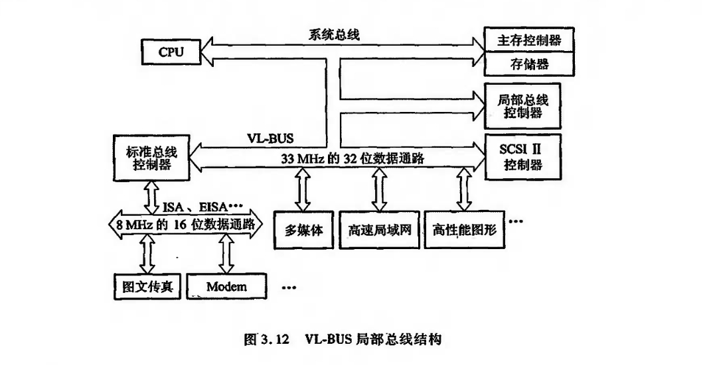
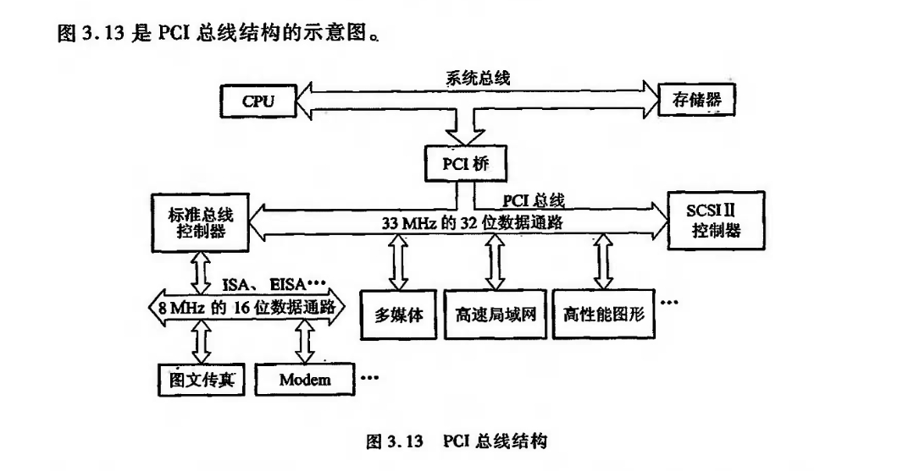

# 总线结构
总线结构通常可分为单总线结构和多总线结构两种
## 单总线结构
## 多总线结构

## 总线结构举例

由图3.11中可见,不论高速局域网、高性能图形还是低速的FAX、Modem都挂接在ISA或EISA总线上,并通过ISA或EISA总线控制器与系统总线相连,这样势必出现总线数据传输的瓶颈。只有将高速、高性能的外设,如高速局域网卡、高性能图形卡等尽量靠近CPU本身的总线并与CPU同步或准同步,才可能消除瓶颈问题。这就要求改变总线结构来提高数据传送速率，为此,出现了图3.12的 VL-BUS 局部总线结构。

由图3.12中可见,将原先挂在ISA总线上的高速局域网卡、多媒体卡、高性能图形卡等从ISA 总线卸下来,挂到局部总线 VL-BUS.上,再与系统总线相连。而将打印机、FAX、Modem 等低速设备仍挂在ISA 总线上。局部总线VL-BUS就相当于在 CPU与高速O设备之间架上了高速通道,使 CPU与高性能外设得到充分发挥,满足了图形界面软件的要求。由于VL-BUS是从CPU总线演化而来的,与CPU的关系太紧密(实际上这种总线与486配合最佳)以致很难支持功能更强的CPU,因此出现了PCI总线。

由于VL-BUS是从CPU总线演化而来的,与CPU的关系太紧密(实际上这种总线与486配合最佳),以致很难支持功能更强的CPU,因此出现了PCI总线。

下面是PCI总线结构示意图

当 PCI总线驱动能力不足时,可采用多层结构。