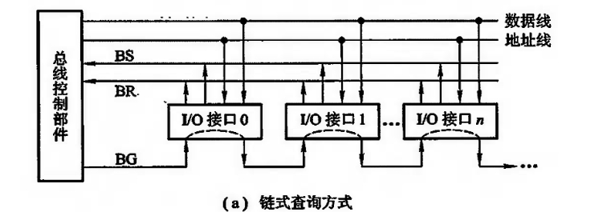
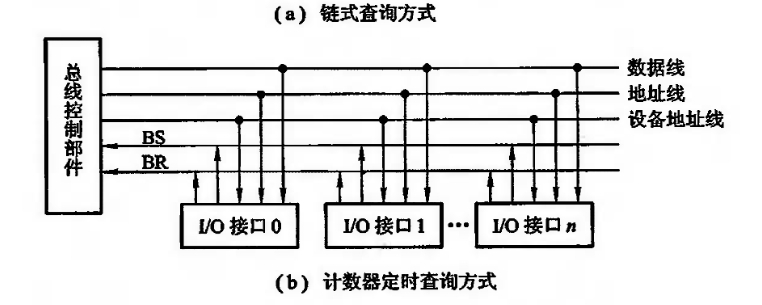

# 总线控制
由于总线上连接着多个部件,什么时候由哪个部件发送信息,如何给信息传送定时,如何防止信息丢失,如何避免多个部件同时发送,如何规定接收信息的部件等一系列问题都需要由总线控制器统一管理。它主要包括判优控制(或称仲裁逻辑)和通信控制。

## 总线的判优控制 (仲裁逻辑)
总线上所连接的各类设备,按其对总线有无控制功能可分为主设备(模块)和从设备(模块)两种。

主设备对总线有控制权,从设备只能响应从主设备发来的总线命令,对总线没有控制权。总线上信息的传送是由主设备启动的,如某个主设备欲与另一个设备(从设备)进行通信时,首先由主设备发出总线诸求信号,若多个主设备同时要使用总线时,就由总线控制器的判优、仲裁逻辑按一定的优先等级顺序确定哪个主设备能使用总线。只有获得总线使用权的主设备才能开始传送数据。

总线判优控制可分集中式和分布式两种,前者将控制逻辑集中在一处(如在CPU中)后者将控制逻辑分散在与总线连接的各个部件或设备上。
常见的集中控制优先权仲裁方式有以下三种。

- 链式查询
链式查询方式如图3.15(a)所示。图中控制总线中有3根线用于总线控制(BS总线忙、BR总线请求、BG总线同意),其中总线同意信号BG是串行地从一个0接口送到下一个O接口。如果BG到达的接口有总线请求,BG信号就不再往下传,意味着该接口获得了总线使用权，并建立总线忙 BS信号,表示它占用了总线。可见在链式查询中,离总线控制部件最近的设备具有最高的优先级。这种方式的特点是:只需很少几根线就能按一定优先次序实现总线控制,并且很容易扩充设备,但对电路故障很敏感,且优先级别低的设备可能很难获得请求。

- 计数器定时查询
计数器定时查询方式如图3.15(b)所示。与图3.15(a)相比,多了一组设备地址线,少了一根总线同意线BG。

总线控制部件接到由BR送来的总线请求信号后,在总线未被使用(BS=0)的情况下,总线控制部件中的计数器开始计数,并通过设备地址线,向各设备发出一组地址信号。

当某个请求占用总线的设备地址与计数值一致时,便获得总线使用权,此时终止计数查询。

这种方式的特点是:计数可以从“0”开始,此时一旦设备的优先次序被固定,设备的优先级就按0,1,…n的顺序降序排列,而且固定不变;计数也可以从上一次计数的终止点开始,即是一种循环方法,此时设备使用总线的优先级相等:计数器的初始值还可由程序设置,故优先次序可以改变。这种方式对电路故障不如链式査询方式敏感,但增加了控制线(设备地址)数,控制也较复杂。

- 独立请求方式

## 总线通信控制
通常将完成一次总线操作的时间称为总线周期,可分为以下4个阶段。
 
- 申请分配阶段
- 寻址阶段 

取得了使用权的主模块通过总线发出本次要访问的从模块(或从设备)的地址及有关命令,启动参与本次传输的从模块。

- 传数阶段
- 结束阶段

对于仅有一个主模块的简单系统,无须申请、分配和撤除,总线使用权始终归它占有。对于包含中断、DMA控制或多处理器的系统,还需要有其他管理机构来参与。

总线通信控制主要解决通信双方如何获知传输开始和传输结束,以及通信双方如何协调如何配合。通常用四种方式:同步通信、异步通信、半同步通信和分离式通信。