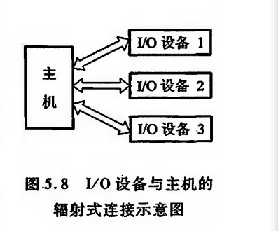

# 概述
## 发展概况
1. 早期阶段
早期的 I/0设备种类较少,0设备与主存交换信息都必须通过CPU,如图5.1所示.

2. 接口模块和DMA阶段
这个阶段 I/0 设备通过接口模块与主机连接,计算机系统采用了总线结构,如图5.2所示。

通常,在接口中都设有数据通路和控制通路。数据经过接口既起到缓冲作用,又可完成串并变换。

许多接口还能满足中断请求处理的要求,使IO设备与CPU可按并行方式工作大大地提高了CPU的工作效率。采用接口技术还可以使多台IO设备分时占用总线,使多台I/0 设备互相之间也可实现并行工作方式,有利于整机工作效率的提高。

虽然这个阶段实现了CPU和I/0设备并行工作,但是在主机与0设备交换信息时,CPU要中断现行程序,即CPU与0设备还不能做到绝对的并行工作。

为了进一步提高 CPU的工作效率,又出现了直接存储器存取(Direct Memory Access,DMA)技术,其特点是 1/0设备与主存之间有一条直接数据通路,I/0设备可以与主存直接交换信息使CPU在I/0设备与主存交换信息时能继续完成自身的工作,故资源利用率得到了进一步提高。

3. 具有通道结构的阶段
4. 具有I/O处理机的阶段

本章主要介绍第二阶段的输入输出系统,有关通道及I/0处理机管理I/0系统的内容将在“计算机体系结构”课程中讲述。

## I/O系统组成
1. 软件

不同结构的输入输出系统所采用的软件技术差异很大。

一般而言,当采用接口模块方式时应用机器指令系统中的I/0指令及系统软件中的管理程序便可使I/0设备与主机协调工作。

当采用通道管理方式时,除IO指令外,还必须有通道指令及相应的操作系统。即使都采用操作系统,不同的机器其操作系统的复杂程度差异也是很大的。

??? note "I/O指令"
    |操作码|命令码|设备码|
    |---|---|---|
    |判定为IO操作|具体操作|设备编号|
    
??? note "通道指令"
    又称通道控制字
    通道指令是通道自身的指令,而I/O指令是CPU指令系统的一部分,由CPU译码后执行

2. 硬件

一般包括接口模块及I/O设备两大部分

## I/O设备与主机的联系方式

I/O设备与主机交换信息和CPU与主存交换信息相比,有许多不同点。

例如,CPU如何对I/0设备编址;

如何寻找I/O设备号;

信息传送是逐位串行还是多位并行;

I/0设备与主机以什么方式进行联络,使它们彼此都知道对方处于何种状态;

I/0设备与主机是怎么连接的,等等。这一系列问题统称为I/0设备与主机的联系方式。

1. I/O设备编址方式

通常将I/0设备码看做地址码,对I/0地址码的编址可采用两种方式:统一编址或不统一编址。

??? note "统一编址"
    统一编址就是将I/0地址看做是存储器地址的一部分。例如,在64K地址的存储空间中划出8K地址作为I/O设备的地址,凡是在这8地址范围内的访问,就是对I/0设备的访问所用的指令与访存指令相似。

??? note "不统一编址"
    不统一编址就是指I0地址和存储器地址是分开的,所有对0设备的访问必须有专用的I/0指令。显然统一编址占用了存储空间,减少了主存容量,但无须专用的 I/O指令。不统一编址由于不占用主存空间,故不影响主存容量,但需设I/O专用指令。因此,设计机器时,需根据实际情况权衡考虑选取何种编址方式。

当设备通过接口与主机相连时,CPU可以通过接口地址来访问I/O设备。

2. 设备寻址

由于每台设备都赋予一个设备号,因此,当要启动某一设备时,可由I/0指令的设备码字段直接指出该设备的设备号。通过接口电路中的设备选择电路,便可选中要交换信息的设备。

3. 传送方式

    - 并行
    - 串行

不同的传送方式需配置不同的接口电路,如并行传送接口、串行传送接口或串并联用的传送接口等。用户可按需要选择合适的接口电路。

---

4. 联络方式

I/O设备与主机之间必须互相了解彼此当时所处的状态,如是否可以传送,传送是否已结束等.

按I/O设备工作速度的不同,可分为三种联络方式.

    - 立即响应方式
    - 异步工作采用应答信号联络
    - 同步工作采用同步时标联络

5. I/O设备与主机的连接方式

??? note "辐射式"
    

??? note "总线式"
    

## I/O 设备与主机信息传送的控制方式

I/0设备与主机交换信息时,共有5种控制方式:

1. 程序查询方式

2. 程序中断方式

3. 直接存储器存取方式(DMA)

4. I/O通道方式

5. 1/O处理机方式。

本节主要介绍前3种方式,后两种方式在5.1.1节已进行了一般介绍,更详尽的内容将由“计算机体系结构”课程讲述。