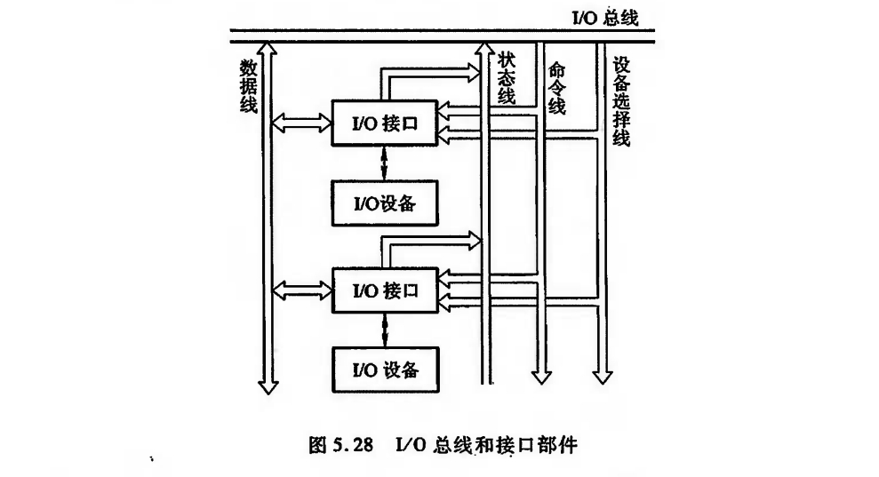

# I/O设备与接口

## I/O设备
---
大致可分为3类

1. 人机交互设备
2. 计算机信息的存储设备
3. 机-机通信设备

本节主要介绍人机交互设备,可分为输人设备和输出设备两种,并且有的设备既具有输人功能,又具有输出功能。

关于存储设备已在第4章介绍过,有关机-机通信设备将在“计算机网络”课程中讲述。

### 输入设备

1. 键盘
2. 鼠标
3. 触摸屏

### 输出设备

1. 显示设备

### 其他I/O设备

??? note "终端设备"
    终端是由显示器和键盘组成的一套独立完整的I/O设备,它可以通过标准接口接到远离主机的地方使用。终端与显示器是两个不同的概念,终端的结构比显示器复杂,它能完成显示控制与存储、键盘管理及通信控制等,还可完成简单的编辑操作。

## I/O 接口

接口可以看做是两个系统或两个部件之间的交接部分,它既可以是两种硬设备之间的连接电路,也可以是两个软件之间的共同逻辑边界。

I/O接口通常是指主机与I/O设备之间设置的一个硬件电路及其相应的软件控制。由图5.13可知,不同的I/O设备都有其相应的设备控制器,而它们往往都是通过I/O接口与主机取得联系的。主机与I/O设备之间设置接口的理由如下:

- 一台机器通常配有多台I/O设备,它们各自有其设备号(地址),通过接口可实现I/O设备的选择。
- I/O设备种类繁多,速度不一,与CPU速度相差可能很大,通过接口可实现数据缓冲,达到速度匹配
-  有些 I/0 设备可能串行传送数据,而 CPU 一般为并行传送,通过接口可实现数据串-并格式的转换。
- 电平转换
- CPU启动I/0设备工作,要向I/O设备发各种控制信号,通过接口可传送控制命令。
-  I/0 设备需将其工作状态(如“忙”“就绪”,“错误”、“中断请求”等)及时向 CPU 报告通过接口可监视设备的工作状态,并可保存状态信息,供CPU查询。

!!! note "接口与端口"
    值得注意的是,接口(Interface)和端口(Port)是两个不同的概念。端口是指接口电路中的一些寄存器,这些寄存器分别用来存放数据信息、控制信息和状态信息,相应的端口分别称为数据端口、控制端口和状态端口。若干个端口加上相应的控制逻辑才能组成接口。CPU 通过输人指令,从端口读人信息,通过输出指令,可将信息写人到端口中。

## 接口的功能和组成

1. 总线连接方式的I/O接口电路

图5.28所示为总线结构的计算机,每一台1/0设备都是通过 1/0接口挂到系统总线上的。

图中的 I/0 总线包括数据线、设备选择线、命令线和状态线。

2. 接口的功能和组成

根据上述设置接口的理由,可归纳出接口通常应具有以下几个功能以及相应的硬件配置。

- 选址
- 传送命令
- 传送数据
- 反应I/O设备工作状态

## 接口类型

按数据传送方式分类

- 并行
- 串行

按功能选择的灵活性分类

- 可编程
- 不可编程

按通用性分类

- 通用
- 专用

按数据传送的控制方式分类

- 程序型
- DMA型
