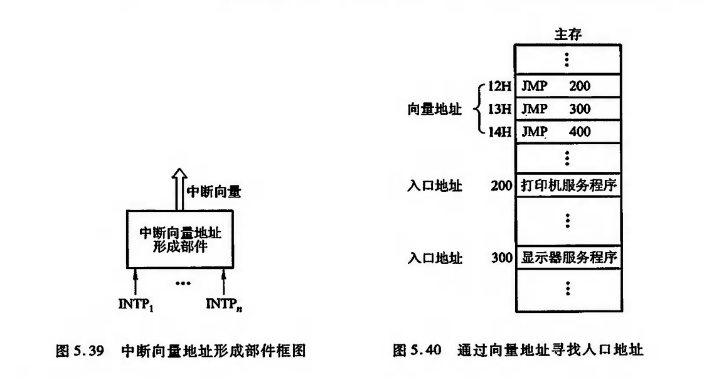
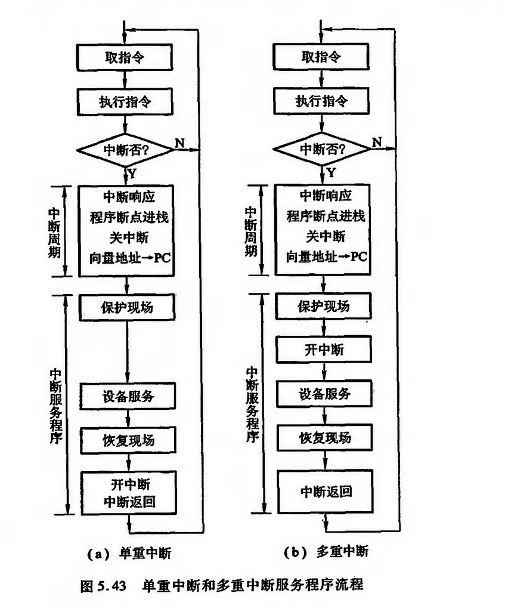

# 程序中断方式

## 中断的概念

计算机在执行程序的过程中,当出现异常情况或特殊请求时,计算机停止现行程序的运行,转向对这些异常情况或特殊请求的处理,处理结束后再返回到现行程序的间断处,继续执行原程序,这就是“中断”。

中断是现代计算机能有效合理地发挥效能和提高效率的一个十分重要的功能。

通常又把实现这种功能所需的软硬件技术统称为中断技术。

## 中断的产生

在 I/O设备与主机交换信息时,由于设备本身机电特性的影响,其工作速度较低,与CPU无法匹配,因此,CPU启动设备后,往往需要等待一段时间才能实现主机与 I/0设备之间的信息交换。如果在设备准备的同时,CPU不作无谓的等待,而继续执行现行程序,只有当I/O设备准备就绪向CPU提出请求后,再暂时中断CPU现行程序转入I/O服务程序,这便产生了I/0中断。

下图是CPU与打印机并行工作的时间示意图

引入中断不仅是为了适应I/O设备工作速度低的问题,也为了应对一切突发事件,例如掉电,响应.

## 程序中断方式的接口电路

1. 中断请求触发器和中断屏蔽触发器

2. 排队器

3. 中断向量地址形成部件 (设备编码器)

## I/O中断处理过程

1. CPU 响应中断的条件和时间

CPU响应I/O设备提出中断请求的条件是必须满足CPU中的允许中断触发器EINT为“1”。

该触发器可用开中断指令置位(称为开中断);

也可用关中断指令或硬件自动使其复位(称为关中断)。

CPU在每条指令执行阶段结束前向接口发出中断查询信号,以获得I/O中断请求.

2. I/O中断处理过程

可将一次中断处理过程简单地归纳为中断请求、中断判优、中断响应、中断服务和中断返回5个阶段。

至于为什么能准确返回至原程序断点,CPU在中断响应阶段除了将向量地址送至PC外,还做了什么其他操作等问题,将在8.4节详细介绍。

## 中断服务程序的流程

- 保护现场

- 中断服务 (主体)

- 恢复现场

- 中断返回

综上所述,从宏观上分析,程序中断方式克服了程序查询方式中的CPU“踏步"现象,实现了CPU与1/0的并行工作,提高了CPU的资源利用率。

但从微观操作分析,发现CPU在处理中断服务程序时仍需暂停原程序的正常运行,尤其是当高速I/0设备或辅助存储器频繁地、成批地与主存交换信息时,需不断地打断CPU执行主程序而执行中断服务程序。

