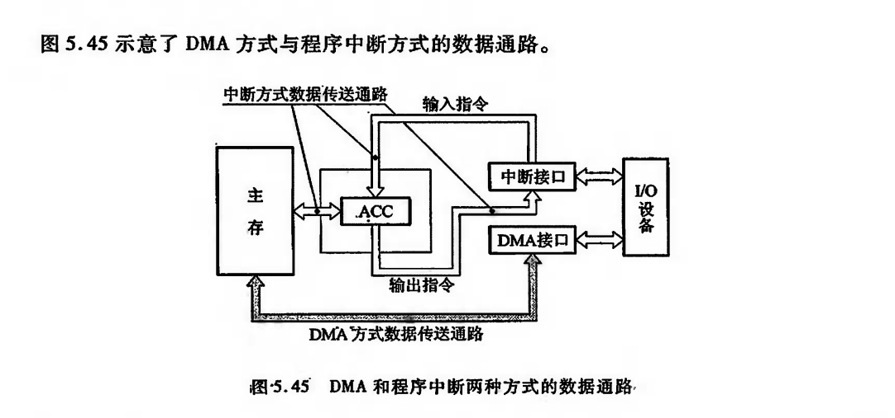
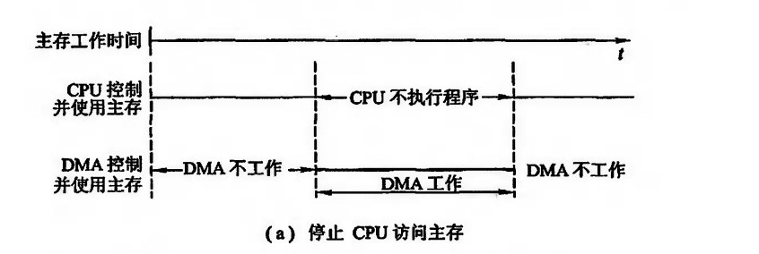
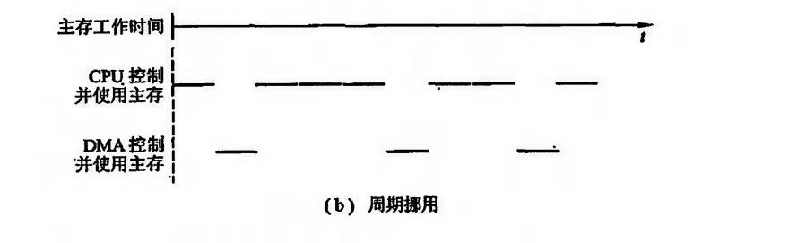
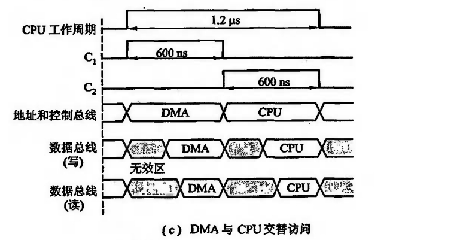
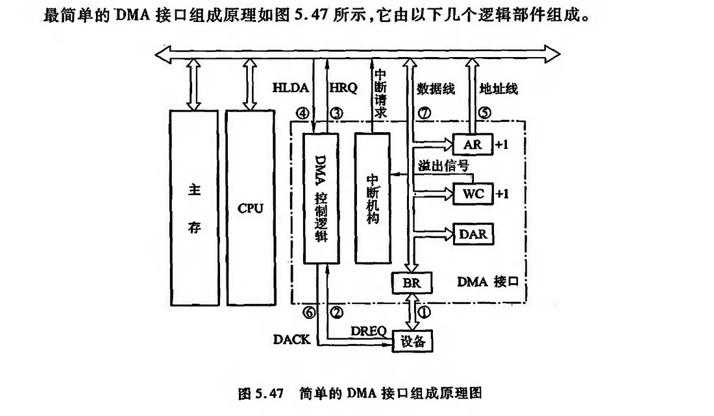
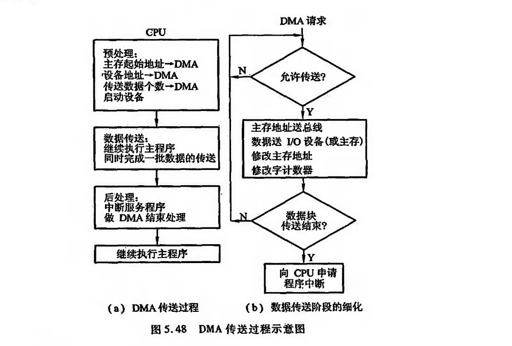
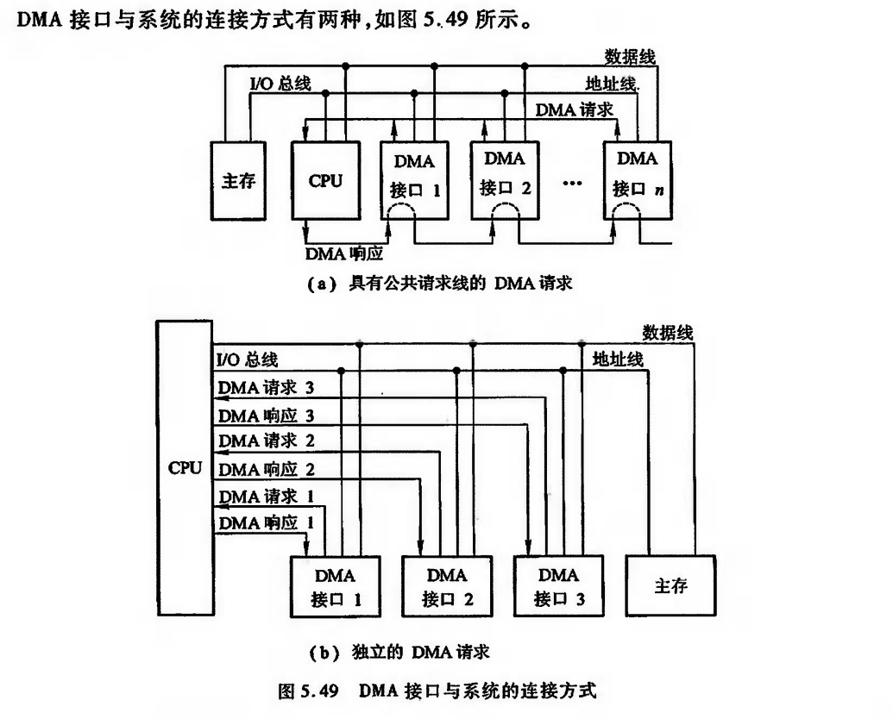

# DMA (Direct Memory Access)方式

## 特点

由图可知,主存与DMA接口有一条数据通路,这适合于高速I/O与主存之间的信息交换.

值得注意的是,若出现高速I/0(通过DMA接口)和CPU同时访问主存,CPU必须将总线(如地址线、数据线)占有权让给DMA接口使用,即DMA采用周期窃取的方式占用一个存取周期。

在DMA方式中,由于DMA接口与CPU共享主存,这就有可能出现两者争用主存的冲突。

为了有效地分时使用主存,通常DMA与主存交换数据时采用如下三种方法。

1. 停止CPU访问主存

2. 周期挪用(或周期窃取)

3. DMA与CPU交替访问

??? note "停止CPU访问主存"

    

??? note "周期挪用(或周期窃取)"

    适用于I/O设备读写周期大于主存周期

    

??? note "DMA与CPU交替访问"

    

## DMA接口功能和组成

DMA接口应有如下功能:

1. 向CPU申请DMA传送

2. 处理总线控制权

3. 控制数据传送

4. 给出DMA操作完成的信号

!!! info "包括"
    
    1. 主存地址寄存器 (AR)

    2. 字计数器 (WC)

    3. 数据缓冲寄存器 (BR)

    4. DMA控制逻辑

    5. 中断机构

    6. 设备地址寄存器 (DAR)

## 工作流程

### 传送过程
分为:

1. 预处理
2. 数据传送
3. 后处理

### 连接方式

### 小结
与程序中断方式相比,DMA方式有如下特点。

①从数据传送看,程序中断方式靠程序传送,DMA方式靠硬件传送。

②从 CPU 响应时间看,程序中断方式是在一条指令执行结束时响应,而DMA方式可在指令周期内的任一存取周期结束时响应。

③程序中断方式有处理异常事件的能力,DMA方式没有这种能力,主要用于大批数据的传送,如硬盘存取、图像处理、高速数据采集系统等,可提高数据吞吐量。

④程序中断方式需要中断现行程序,故需保护现场;DMA 方式不中断现行程序,无须保护现场。

⑤DMA的优先级比程序中断的优先级高。
