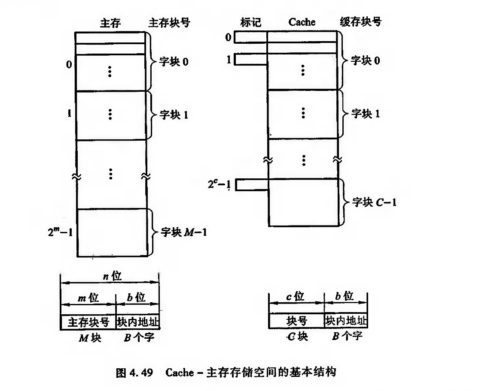
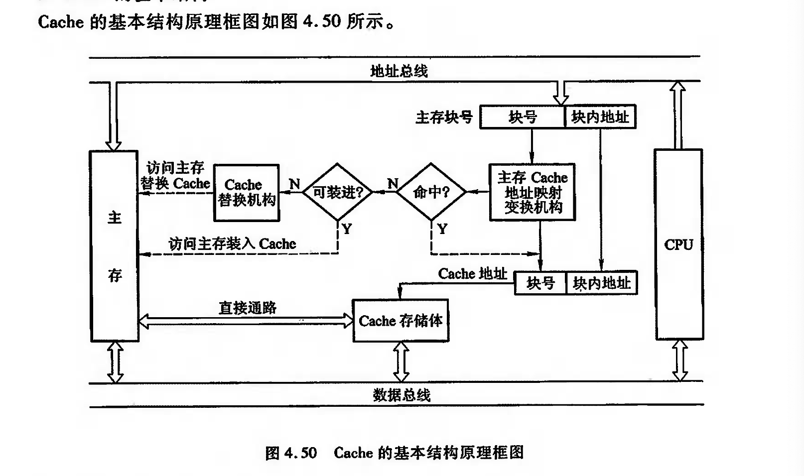
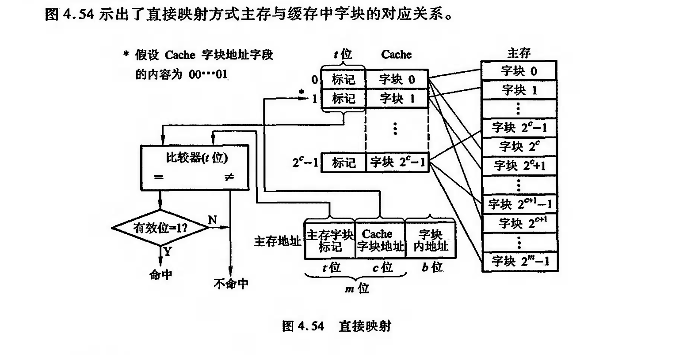

# 高速缓存存储器

## Cache的工作原理

!!! note "注意"

    \[ 2^m=M \]

    Cache 与 主存储器 的 块 的大小一样

    CPU读信息时,将主存地址的高m位(或m位中的一部分)与缓存块的标记进行比较,以判断所读信息是否在缓存中

任何时刻都有一些主存块处在缓存块中。

CPU欲读取主存某字时,有两种可能:一种是所需要的字已在缓存中,即可直接访问 Cache(CPU 与 Cache 之间通常一次传送一个字);

另一种是所需的字不在 Cache 内,此时需将该字所在的主存整个字块一次调入 Cache 中(Cache 与主存之间是字块传送)。

如果主存块已调人缓存块,则称该主存块与缓存块建立了对应关系.

命中率

\[h=\frac{N_c}{N_c+N_m}\]

\[t_a=ht_c+(1-h)t_m\]

显然\(t_a\)越接近\(t_c\)越好.用\(e\)表示访问效率,则有

\[e=\frac{t_c}{t_a}\]

## Cache 的基本结构

1. Cache存储体

大多采用多体结构,且访存优先级最好

2. 地址映射变换机构
3. 替换机构
3. Cache的读写操作
4. 改进

## Cache--主存地址映射
### 直接映射

图中每个主存块只与一个缓存块对应,映射关系式为

\[i=j \bmod C \qquad 或 \qquad i=j \bmod 2^c\]

- i为缓存块号
- j为主存块号
- C为缓存块数

映射结果表明每个缓存块对应若干个主存块

??? example "例子"

    当缓存接到 CPU 送来的主存地址后,只需根据中间c位字段(假设为00…01)找到 Cache 字块1,然后根据字块1的“标记”是否与主存地址的高t位相符来判断,若符合且有效位为“1”(有效位用来识别 Cache 存储块中的数据是否有效,因为有时 Cache 中的数据是无效的,例如,在初始时刻 Cache应该是“空”的,其中的内容是无意义的),表示该 Cache 块已和主存的某块建立了对应关系(即已命中),则可根据b位地址从 Cache 中取得信息,若不符合,或有效位为“0”(即不命中),则从主存读人新的字块来替代旧的字块,同时将信息送往 CPU,并修改 Cache“标记”。如果原来有效位为“0”,还得将有效位置成“1”。

### 全相联映射

全相联映射允许主存中的每一字块映射到Cache中的任何一块位置上.

与直接映射相比,它的主存字块标记从t位增加到t+c位,这就使得Cache“标记”的位数增多,而且访问Cache时主存字块标记需要和Cache的全部标记位进行比较,才能判断出所访问的主存地址内容是否已在Cache中.

这种比较通常采用“按内容寻址”的相联存储器来完成.

!!! note "相联存储器"

    pass

### 组相联映射

它把Cache分为Q组,每组有R块,并有以下关系:

\[i = j \bmod Q\]

- i为缓存的组号
- j为主存的块号

某一主存按模Q将其映射到缓存的第i组,如图

!!! example "例子"
    假设c=5,q=4,则r=c-q=1.

    实际含义为:Cache共有\(2^c=32\)个字块,共分为\(2^q=16\)组,每组包含2块.

    组内2块的组相连映射又称为二路组相联

当r=0时是直接映射方式

当r=c时时全相联映射方式

## 替换策略

1. 先进先出
2. 近期最少使用
3. 随机法
