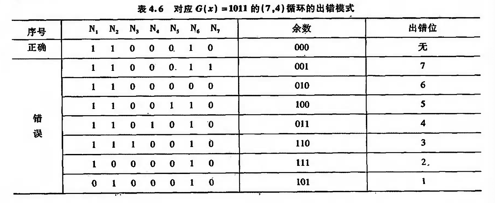

# 辅助存储器

## 循环冗余效验码

CRC(Cyclic Redundancy Check)码可以发现信息在存储或传送过程中连续出现的多位错误.

因此,CRC效验码在磁介质存储器和计算机之间通信方面得倒广泛应用.

CRC码时基于模2运送而建立编码规律的效验码.模2运算的特点是不考虑进位和借位的运算,其规律如下:

1. 模2加和模2减的结果是相等的    (异或)
2. 模2乘时按模2和球部分积之和
3. 模2除是按模2减求部分余数.每求一位商应使部分余数减少1位.上商的原则是:当部分余数的首位位1,上商1,反之上商0.

### CRC码的编码方法

设代编的信息码为\(D_{n-1}D_{n-2} \ldots D_{2}D_{1}D_{0}\),可用多项式\(M(x)\)表示:

\[M(x)=D_{n-1}x^{n-1}+D_{n-2}x^{n-2}+ \ldots +D_{2}x^2+D_{1}x^1+D_{0}x^0\]

将信息码左移k位,得

\[D_{n-1+k}D_{n-2+k} \ldots D_{2+k}D_{1+k}D_{0+k}\underbrace{00000 \ldots 0}_{k个0}\] 

即\(M(x) \cdot x^k\),空出的k为余数作为效验位

CRC码就是用多项式\(M(x) \cdot x^k\)除以生成多项式\(G(x)\)(一个用来产生效验码的多项式),
所得余数作为效验位.

为了得到k为余数,\(G(x)\)必须是k+1位

设余数为\(R(x)\),商为\(Q(x)\),则有

\[M(x) \cdot x^k = Q(x) \cdot G(x) + R(x)\]

将余数拼接到信息码后面,就得到了这个有效信息的CRC码.

\[\begin{align}
M(x) \cdot x^k + R(x) & = [Q(x) \cdot G(x) + R(x)] + R(x)\\
& = [Q(x) \cdot G(x)]+[R(x) + R(x)]\\
& = Q(x) \cdot G(x)
\end{align}\]

因此,所得 CRC 码是一个可被生成多项式 G(x)除尽的数码。如果 CRC 码在传输过程中不出错,其余数必为 0;如果传输过程中出错,则余数不为0,再由该余数指出哪一位出错,即可纠正。

### CRCa码的译码和纠错

将收到的循环校验码用约定的生成多项式 G(*)去除,如果无错,则余数应为0,如果某一位出错,则余数不为 0。不同的出错位其余数也不同,表4.6 列出了对应 \(G(x)\)= 1011 的出错模式。

可以证明，更换不同的待测码字，余数和出错位的对应关系不变，只与码制和生成多项式有关 。 表 4.6 给 出 的 关 系 只 对 应 C ( x ) = 1 0 1 1 的 (7 , 4 ) 码 ， 对 于 其 他 码 制 或 选 用 其 他 生 成 多 项 式 ， 出错模式將发生变化.

