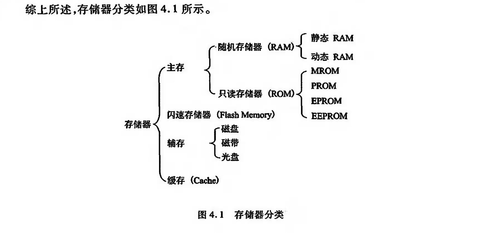
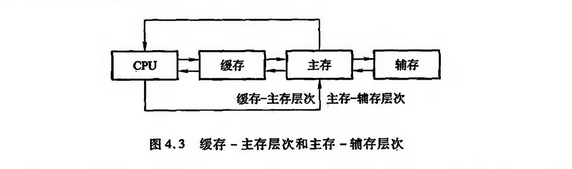

# 存储器
## 概述

存储器的分类

按存储介质

1. 半导体存储器
2. 磁表面存储器
3. 磁芯存储器
4. 光盘存储器

按存取方式

1. 随机存储器
2. 只读存储器
3. 串行访问存储器

按在计算机中的作用分类

主要有主存储器,辅助存储器,缓冲存储器

## 存储器的层次结构

实际上,存储系统层次结构主要体现在缓存-主存和主存-辅存这两个存储层次上,如图4.3所示。

显然,CPU和缓存、主存都能直接交换信息;缓存能直接和 CPU、主存交换信息;主存可以和 CPU、缓存、辅存交换信息。

主存和缓存之间的数据调动是由硬件自动完成的,对程序员是透明的.

主存和辅存之间的数据调动是由硬件和操作系统共同完成的.

---

程序的地址范围与虚拟存储器的地址空间相对应。例如,机器指令地址码为24位,则虚拟存储器存储单元的个数可达16M。

可是这个数与主存的实际存储单元的个数相比要大得多,称这类指令地址码为虚地址(虚存地址、虚拟地址)或逻辑地址,而把主存的实际地址称为物理地址或实地址。物理地址是程序在执行过程中能够真正访问的地址,也是实实在在的主存地址。

对具有虚拟存储器的计算机系统而言,程序员编程时,可用的地址空间远远大于主存空间,使程序员以为自己占有一个容量极大的主存,其实这个主存并不存在,这就是将其称为虚拟存储器的原因对虚拟存储器而言,其逻辑地址变换为物理地址的工作是由计算机系统的硬件和操作系统自动完成的,对程序员是透明的。

当虚地址的内容在主存时,机器便可立即使用:若虚地址的内容不在主存,则必须先将此虚地址的内容传递到主存的合适单元后再为机器所用。有关这些方面的内容,读者可在“计算机体系结构”和“操作系统”课程中学到。

