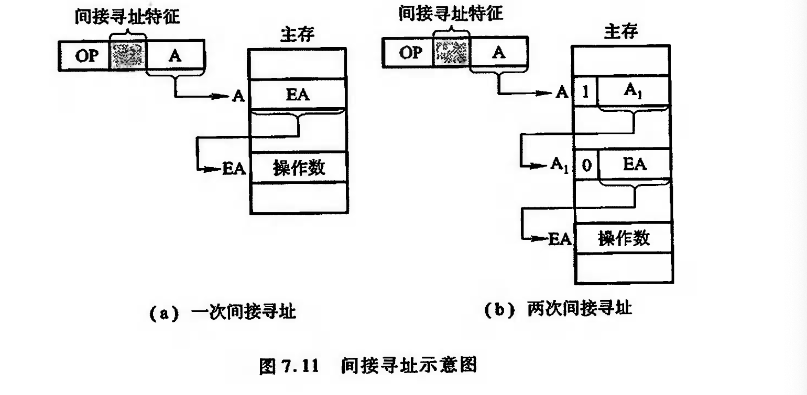

# 指令的寻址方式

## 指令寻址

1. 顺序寻址  即程序计数器PC加一
2. 跳跃寻址 

通过转移类指令实现

至于跳跃寻址的转移地址的形成方式 ,在下面介绍

### 数据寻址

数据寻址的方式较多，为区别各种方式，通常在指令字中设置一个寻址特征字段，用来指明属于哪种寻址方式（其位数决定了寻址方式的种类）。

指令中的地址码字段不代表操作数的真实地址，这种地址被称为形式地址（A）。形式地址结合寻址方式，可以计算出操作数在存储器中的真实地址，这种地址被称为有效地址（EA）

为了便于分析各类寻址方式,假设指令字长,存储字长,机器字长均相同

### 常见的数据寻址方式

!!! note "隐含寻址"
    隐含寻址是指指令字中不明显地给出操作数的地址,其操作数的地址隐含在操作码或某个寄存器中。例如,一地址格式的加法指令只给出一个操作数的地址,另一个操作数隐含在累加器ACC 中,这样累加器 ACC 成了另一个数的地址。图 7.10 示意了隐含寻址。
    

    又 如 I B M P C ( i n t e l 8 0 8 6 ) 中 的 乘 法 指 令 ，被 乘数 隐 含 在 寄 存 器 A x ( 1 6 位 )或 寄 存 器 A L ( 8 位)中，可见Ax(或AL)就是被乘数的地址。
    
    又如字符串传送指令MOVS, 其源操作数的地址隐 含 在 S I 寄 存 器 中 ( 即 操 作 数 在 S I 指 明 的 存 储 单 元 中 ) ，目 的 操 作 数 的 地 址 隐 含 在 D 1 寄 存 器 中 。

    由于隐含寻址在指令字中少了一个地址，因此，这种寻址方式的指令有利于缩短指令字长。

!!! note "直接寻址"
    直接寻址的特点是，指令字中的形式地址A就是操作数的真实地址区A，即EA=A

    它的优点是寻找操作数比较简单，也不需要专门计算操作数的地址，在指令执行阶段对主 存只访问一饮。它的缺点在于A的位数限制了操作数的寻址范圃，而且必须修改A 的值，才能 修改操作数的地址。

!!! note "间接寻址"
    倘若指令宇中的形式地址不直接指出操作数的地址，而是指出操作数有效地址所在的存储 单元地址，也就是说，有效地址是由形式地址间接提供的，即为间接导址，即区EA=( A)，如图7. 11 所示。
    

    这种寻址方式与直接寻址相比，它扩大了操作数的寻址范围，因为A 的位数通常小于指令 宇长，而存储字长可与指令宇长相等。若设指令字长和存储字长均为16 位，A 为8 位, 显然直接 寻址范围为\(2^8\),一次间接导址的寻址范国可达\(2^16\) 。
    
    当多次间接导址时，可用存储宇的首位来标 志 间 接 寻 址 是 否 结 束 。 如 图 7 . 1 1 ( 6 ) 中 ，当 存 储 字 首 位 为 “ 1 ” 时 ，标 明 还 需 继 续 访 存 导 址 ; 当 存 储宇首位为“0” 时，标明该存储字即为EA。由此可见，存储宇首位不能作为区A的组成部分，因 此, 它的导址范围为\(2^{15}\) 。

    间接寻址的第二个优点在于它便于编制程序。例如，用间接寻址可以很方便地完成子程序 返回, 因7. 12示意了用手子程序返回的间址过程

    

    图中表示两次调用子程序，只要在调用前先将返回地址存人子程序最末条指令的形式地址 A前的存储单元内，便可准确返回到原程序断点。例如，第一次调用前，使[A] =81,第二次调用 ， 使 [ A ] = 2 0 2 。 这 样 ，当 第 一 次 子 程 序 执 行 到 最 末 条 指 令 “ J M P @ A ” ( @ 为 间 址 特 征 位 ) ，便 可 无条件转至81 号单元。同理, 第 二次执行完子程序后，便可返回到202 号单元。

    问 接 寻 址 的 缺 点 在 于 指 令 的 执 行 阶 段 需 要 访 存 两 次 ( 一 次 间 接 号 址 )或 多 饮 (多 次 间 接 寻 址)，致使指令执行时间问延长。

!!! note "立即数寻址"
    
    立即数用补码形式存放

!!! note "寄存器寻址"
    在寄存器寻址的指令字中,地址码字段直接指出了寄存器的编号,即 EA=\(R_i\),如图 7.13 所示。其操作数在由 \(R_i\)所指的寄存器内。由于操作数不在主存中,故寄存器寻址在指令执行阶段无须访存,减少了执行时间。由于地址字段只需指明寄存器编号(计算机中寄存器数有限),故指令字较短,节省了存储空间,因此寄存器寻址在计算机中得到广泛应用。
    

!!! note "寄存器间接寻址"
    

!!! note "相对寻址"
    相对寻址的有效地址是将程序计数器 PC 的内容(即当前指令的地址)与指令字中的形式地 址 A 相加而成, 即
    
    \[EA=(PC)+A\]

    

!!! note "基址寻址"
    基址寻址需设有基址奇存器 BR, 其操作数的有效地址EA 等于指令字中的形式地址与基址 寄存器中的内容(称为基地址)相加，即
    
    \[EA=A+(BR)\]
    

    基址寄存器可采用隐式的和显式的两种。所谓隐式，是在计算机内专门设有一个基址寄存 器BR, 使用时用户不必明显指出该基址寄存器，只需由指令的导址特征位反映出基址寻址即可。 显式是在一组通用寄存器里，由用户明确指出哪个奇存器用做基址奇存器，存放基地址。

    IBM370 计算机中设有16 个通用奇存器，用户可任意选中某个寄存器作为基址寄存器。对应图 7.15(a)为隐式基址寻址，图7. 15(6)为显式基址寻址

    基址寻址在多道程序中极为有用。用户可不必考惠自己的程序存手主存的哪 一空问区域， 完全可由操作系统或管理程序根据主存的使用状况，, 賦子基址寄存器内一个初始信( 即基地 址)，便可将用户程序的逻辑地址转化为主存的物理地址( 实际地址)，把用户程序安置于主存的 某一空间区域。

!!! note "变址寻址"
    变址寻址与基址寻址极为相似。其有效地址EA等于指令宇中的形式地址A与变址寄存器 区 的 内 容 相 加 之 和 ，即
    
    \[EA=A+(IX)\]

    由于两者的应用场合不同，因此从本质来认识，它们还是有较大的区别。基址寻址主要 用于为程序或数据分配存储空间, 故基址奇存器的内容通常由操作系统或管理程序确定，在程序的执行过程中其值是不可变的，而指令字中的A 是可变的。

    在变址寻址中，变址寄存器的内容 是 由 用 户 设 定 的 ，在 程 序 执 行 过 程 中 其 值 可 变 ， 而 指 令 字 中 的 A 是 不 可 变 的 。 变 址 寻 址 主 要 用 于 处 理 数 组 问 题 ， 在 数 组 处 理 过 程 中 ，可 设 定 A 为 数 组 的 首 地 址 ，不 断 改 变 变 址 寄 存 器 IX 的 内 容,便可很容易形成数组中任 一数据的地址，特别适合编制循环程序。

    有的机器(如Intel 8086 、VAx - 11)的变址寻址具有自动变址的功能，即每存取一个数据，根 据数据长度( 即所占字节数)，变址寄存器能自动增量或减量，以便形成下一个数据的地址。

!!! note "堆栈寻址"

    堆栈寻址要求计算机中设有堆栈。堆栈既可用寄存器组(称为硬堆栈)来实现，也可利用主 存的一部分空间作堆栈( 称为软堆栈) 。堆栈的运行方式为先进后出或先进先出两种，先进后出 型堆栈的操作数只能从一个又进行读或写。

    以软堆栈为例，可用堆栈指针SP ( Stack Point ) 指出 栈项地址，也可用CPU中一个或两个寄存器作为SP。操作数只能从栈项地址指示的存储单元 存或取。可见堆栈寻址也可视为一种隐含寻址，其操作数的地址;总被隐含在SP 中。堆栈寻址就 其本质也可视为寄存器间接寻址，因SP可视为寄存器，它存放着操作数的有效地址。