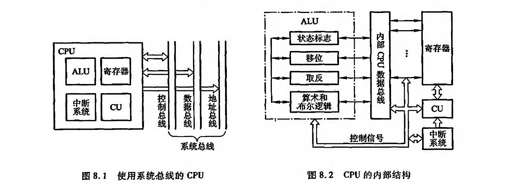
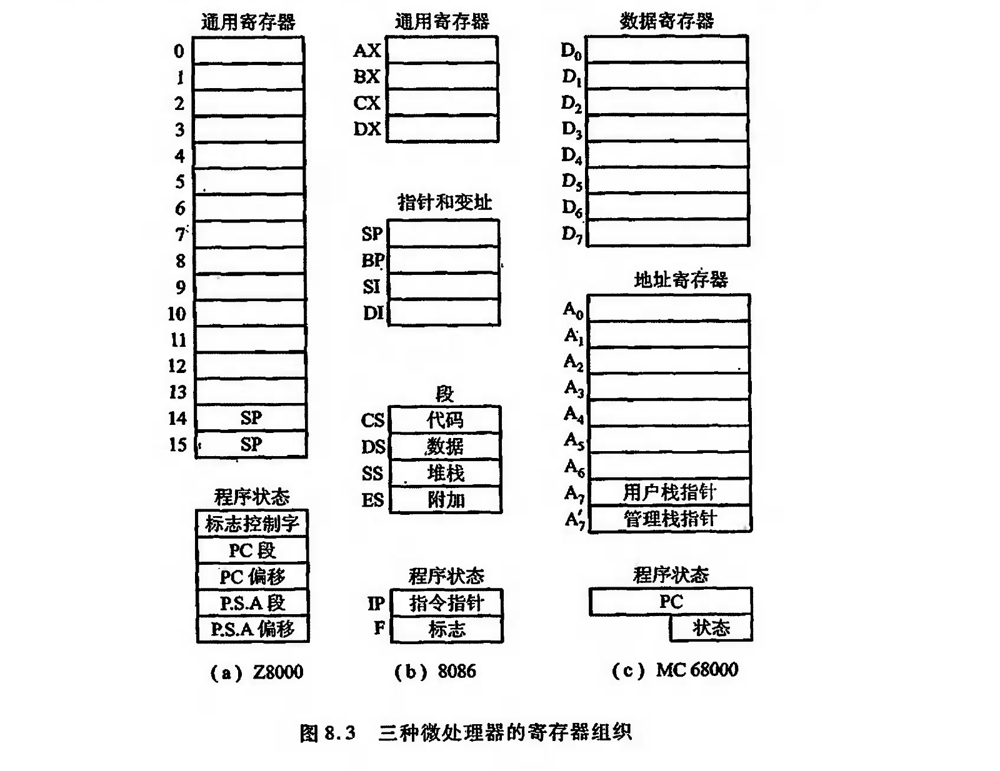
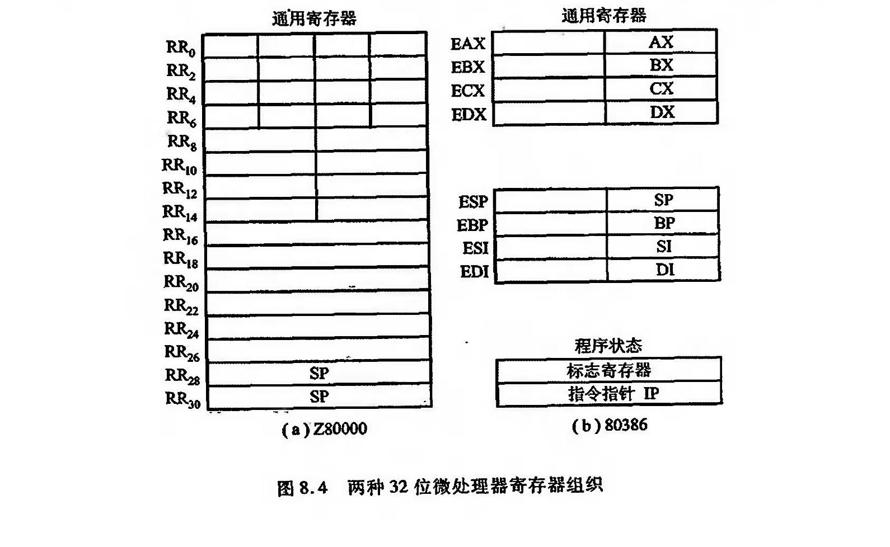

# CPU的结构
## CPU的功能

由第1章可知, CPU实质包括运算器和控制器两大部分, 第6章讨论了计算机内各种运算及相应的硬件配置，这里重点介绍控制器的功能。

对于冯•诺依曼结构的计算机而言, 一旦程序进人存储器后，就可由计算机自动完成取指令 和执行指令的任务，控制器就是专用于完成此项工作的，它负责协调并控制计算机各部件执行程 序的指令序列，其基本功能是取指令、分析指令和执行指令。

1. 取指令
2. 分析指令
3. 执行指令

执 行 指 令 就 是 根 据 分 析 指 令 产 生 的 “ 操 作 命 令 ” 和 “ 操 作 数 地 址 ” 的 要 求 ，形 成 操 作 控 制 信 号 序列(不同的指令有不同的操作控制信号序列)

此外控制器还必须有处理中断的能力

总 之 , C P U 必 须 具 有 控 制 程 序 的 顺 宇 执 行 ( 称 指 令 控 制 ) 、产 生 完 成 每 条 指 令 所 需 的 控 制 命 令( 称操作控制)、对各种操作加以时间 上的控制( 称时问控制) 、对数据进行算术运算和逻辑运 算( 数据加工)以及处理中断等功能.

## CPU结构框图

## CPU 的寄存器

CPU 中的寄存器大致可分两类:一类展于用户可见寄存器， 用户可对这类寄存器编程，以及通过优化使CPU因使用这类寄存器而减少对主存的访问次效;

另一类属于控制和状态奇存器，用户不可对这类寄存器编程，它们被控制部件使用，以控制CPU 的操作，也可被带有特权的操作系统程序使用，从而控制程序的执行。

??? note "用户可见"

    - 通用寄存器
    - 数据寄存器
    - 地址寄存器
    - 条件码寄存器 (部分透明)

??? note "控制和状态寄存器"

    - MAR:
    - MDR
    - PC
    - IR
    - PSW (program state word)

!!! note "举例"

    不同计算机的CPU中,奇存器组织是不一样的
    

    计算机的设计者们为了给在早期计算机上编写的程序提供向上的兼容性，在新计算机的设 计上经常保留原设计的奇存器组织形式。

    

## 控制单元和中断系统

控制单元( CU)是提供完成计算机全部指令操作的微操作命令序列部件。现代计算机中

微操作命令序列的形成方法有两种:一种是组合逻辑设计方法，为硬连线逻辑; 另—种是微程序设 计方法，为存储逻辑。
