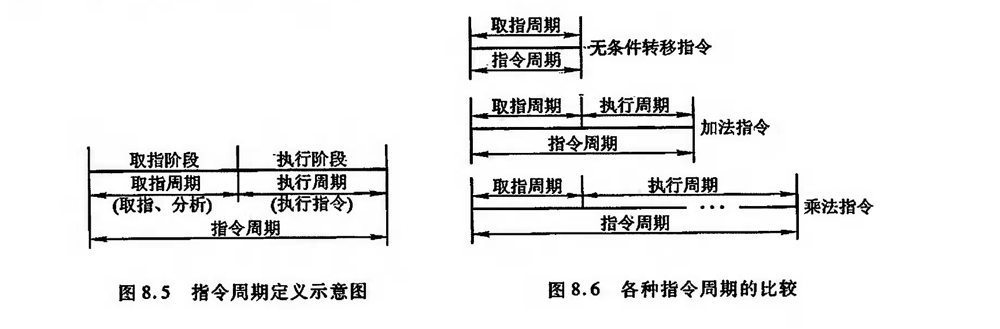
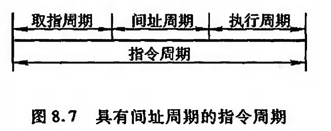
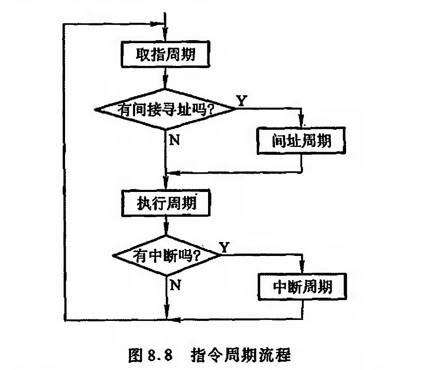
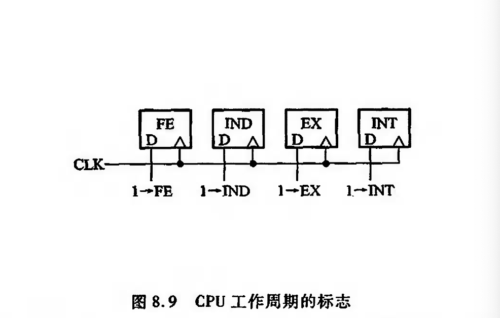
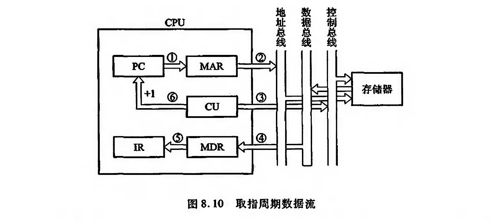
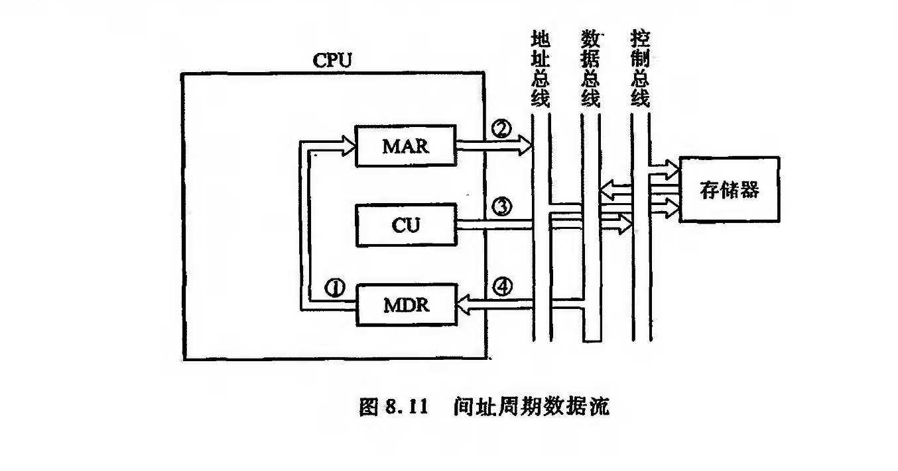
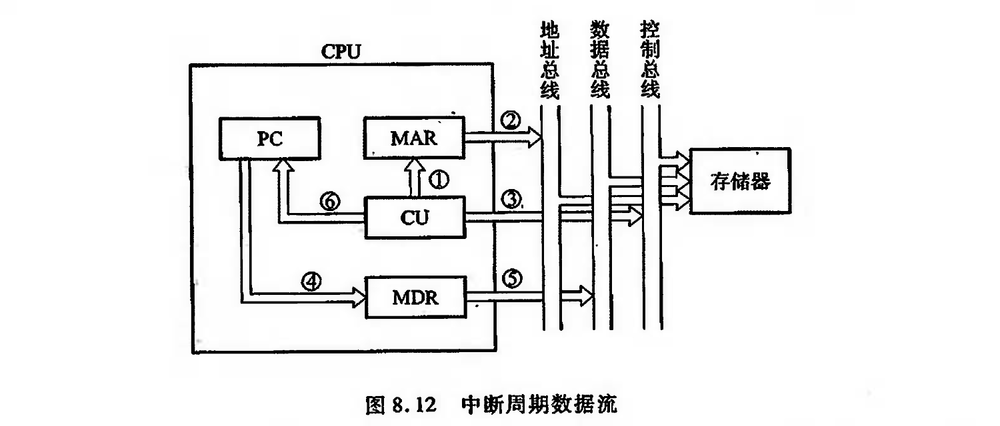

# 指令周期

## 概述

CPU每取出并执行一条指令所需的全部时间称为指令周期，也即CPU完成 一条指令的时 间

当 C P U 采 用 中 断 方 式 实 现 主 机 与 I/O设备交换信息时,CPU 在每条指令执行阶段结束前，都要指 令周期 发中断查询信号，以检测是否有某个1/0 设备提出中断请 求。如果有请求，CPU则要选人中断响应阶段，又称中断周期.

这样，一个完整的指令周期应包括取指、问址、执行和中断4 个子周期，如图8. 8 所示。由于间址 周期和中断周期不一定包含在每个指令周期内，故图中用菱形框判断。

为了区分这4个周期, 在 C P U 内 可 设 置 4 个 标 志 触 发 器

图8. 9 所示的FE、IND、EX和INT 分别对应取指、问址、执行和中断 4 个周期，并以“1”状态 表示有效，它们分别由了1->FE、1一>IND、1 ->EX 和1 ->INT这4个信号控制

设置CPU工作周期标志触发器对设计控制单元十分有利。例如，在取指阶段，只要设置取 指 周 期 标 志 触 发 器 F E 为 1 , 由 它 控 制 取 指 阶 段 的 各 个 操 作，便 获 得 对 任 何 一 条 指 令 的 取 指 命 令 序列。又如，在间接寻址时，问址次数可由同址周期标志触发器INVD确定，当它为“0” 狀态时，表 示间接导址结束。再如，对于一些执行周期不访存的指令( 如转移指令，寄存器类型指令)，同样 可以用它们的操作码与取指周期标志触发器的状态相“与” ，作为相应微操作的控制系件。在控制单元的设计中可进 一步体会。

## 指令周期的数据流

为 了 便 于 分 析 指 令 周 期 中 的 数 据 流 ， 假 设 C P U 中 有 存 储 器 地 址 奇 存 器 M A R 、存 储 器 数 据 寄 存器MDR、程序计数器FC和指令寄存器IR。

??? note "取址周期"

    

??? note "间址周期"

    

??? note "执行周期"

    由于不同的指令在执行周期的操作不同, 因此执行周期的数据流是多种多样的，可能涉及 CPU 内部寄存器间的数据传送、对存储器( 或I/O )进行读写操作或对 ALU 的操作，因此，无法用 统一的数据流图表示。

??? note "中断周期"

    指保存PC
    
    因中由CU 把用于保存程序断点的存储器特殊地址( 如栈指针的内容) 送往MAR, 并送到地 址 总 线 上 , 然 后 由 C U 向 存 储 器 发 写 命 令 ，并 将 P C 的 内 容 ( 程 序 断 点 )送 到 M D R ，最 终 使 程 序 断 点经数据总线存人存儲器。此外，CU还需將中断服务程序的入口地址送至PC, 为下一个指令周期的取指周期做好准备。

