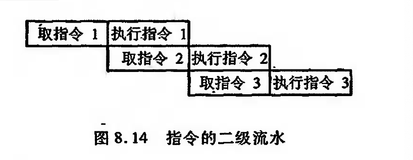
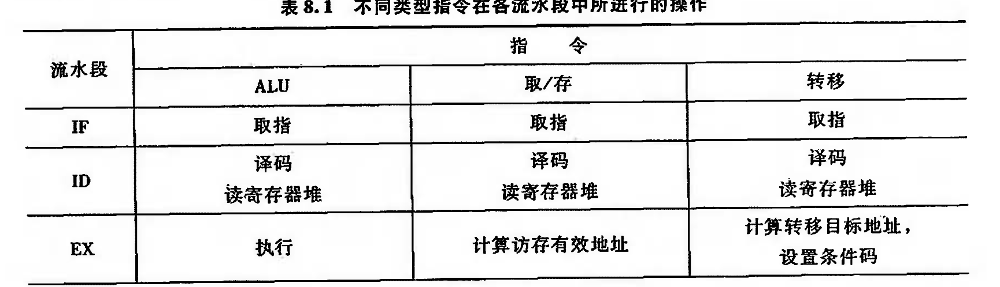
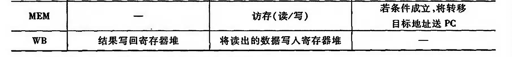

# 指令流水

为了进一步提高处理机速度,通常可从提高器件的性能和改进系统的结构,开发系统的并行性两方面入手。

所 谓 并 行 ，包 含 同 时 性 和 并 发 性 两 个 方 面 。 前 者 是 指 两 个 或 多 个 事 件 在 同 一时 刻 发 生 , 后 者 是指两个或多个事件在同一时间段发生

也就是说，在同一时刻或同一时问段内完成两种或两 种以上性质相同或不同的功能，只要在时间上互相重叠, 就存在并行性。

并 行 性 体 现 在 不 同 等 级 上 。 通 常 分 为 4 个 级 别 :

作业级或程序级 、任务级或进程级 、指令之间级 、指令内部级

前两级为粗粒度,又称过程级;后两级为细粒度,又称指令级.

前者一般用软件实现,后者一般用硬件实现.

从计算机体系上看，粗粒度并行性是在多个处理机上分别远行多个进程， 由多台处理机合作完成一个程序;细粒度并行性是指在处理机的操作级和指令级的并行性，其中 指 令 的 流 水 作 业 就 是 一项 重 要 技 术 。 这 里 只 讨 论 有 关 指 令 流 水 的 一 些 主 要 问 题.

## 指令流水的原理

为简单起见，把指令的处理过 程分为取指令和执行指令两个阶段，在不采用流水技术的计算机里，取指令和执行指令是周而复 始地重复出现，各条指令按顾序串行执行的，如图8. 13 所示。

图中取指令的操作可由指令部件完成, 执行指令的採作可由执行部件完成。进一步分析发 现 , 这 种 顺 序 执 行 虽 然 控 制 简 单 ， 但 执 行 中 各 部 件 的 利 用 率 不 高 ， 如 指 令 部 件 工 作 时 ，执 行 部 件 基 本空闲，而执行部件工作时，指令部件基本空闲。如果指令执行阶段不访问主存，则完全可以利 用这段时间取下一系指令，这样就使取下一条指令的操作和执行当前指令的操作同时进行,这就是两条指令的重叠，即指令的二级流水。

如果取址和执行阶段在时间上完全重叠,相当于将指令周期减半.

显然由于以下两个原因使得执行效率加倍是不可能的:

1. 指令的执行时间一般大手取指时间，因此,取指阶段可能要等待一段时间，也即存放在指 令部件绥沖区的指令还不能立即传给执行部件，缓冲区不能空出。

2.  当退到条件转移指令时，下一条指令是不可知的，因为必须等到执行阶段结束后，才能获 知 条 件 是 否 成 立 ，从 而 决 定 下 条 指 令 的 地 址 ，造 成 时 间 损 失 。

通常为了减少时间损失，采用猜测法，即当条件转移指会从取指阶段进人执行阶段时，指令 部件仍按顺序预取下一条指令。这样，如果条件不成立，转移没有发生，则没有时间损失;若条件 成立,较毯发生，则所取的指令必领丢掉，并再取新的指令。

尽管这些因素降低了两级流水线的潜在效率，但还是可以获得一定程度的加速。为了进一 步提高处理速度，可将指令的处理过程分解为更细的几个阶段。

1. 取址(FI)
2. 指令译码(DI)
3. 计算 操作数地址(CO)
4. 取操作数(FO)
5. 执行指令(EI)
6. 写操作数(WO)

## 影响流水线性能的因素

要使流水线具有良好的性能，必須设法使流水线能畅通流动，即必领做到充分流水,不发生 断流。但通常由于在流水过程中会出现三种相关，使流水线不断流实现起来很困难，这三种相关 是结构相关、数据相关和控制相关。

结构相关是当多条指令进人流水线后，硬件资源满足不了指令重香执行的要求时产生的。 数据相关是指令在流水线中重叠执行时，当后继指令篇要用到前面指令的执行结果时发生的。 控制相关是当流水线退到分文指令和其他改变PC值的指令时引起的。

下面假设流水线由5段组成,它们分别是取指令(IF)、指令译码/ 读寄存器 (ID)、执行/访存有效地址计算(Ex) 、存储器访问(MEM) 、结果写回奇存器(WB)。

不同类型指令在各流水段的操作是不同的，表8.1列出了ALU类指令、访存类(取数、存数) 指令和转移类指令在各流水段中所进行的操作。

1. 结构相关

通常, 大多数机器都是将指令和数据保存在同一存储器中，且只有一个访问又，如果在某个 时钟周期内，流水线既要完成某条指令对操作数的存储器访问操作，又要完成另 一条指令的取指 操 作 ，这 就 会 发 生 访 存 冲 突 

2. 数据相关

数据相关是流水线中的各条指令因重叠操作，可能改变对操作数的读写访问顺序，从而导致 了数据相关冲突。

3. 控制相关

## 流水线性能

!!! note "吞吐率"

    在指令级流水线中，吞吐率是指单位时间内流水线所完成指令或输出结果的数量。吞吐率 又有最大吞吐率和实际吞吐率之分。

!!! note "加速比"

    流水线的加速此是指 m 段流水线的速度 与等功能的非流水线的速度之比。

!!! note "效率"

    效率是指流水线中各功能段的利用率。由手流水线有建立时间和排空时间，因此各功能段 的设备不可能一直处于工作状态，总有一段空闲时间

## 流水线的多发技术

### 超标量技术
### 超流水线技术
### 超长指令字技术

## 流水线结构

### 指 令 流 水 线 结 构
### 运算流水线
